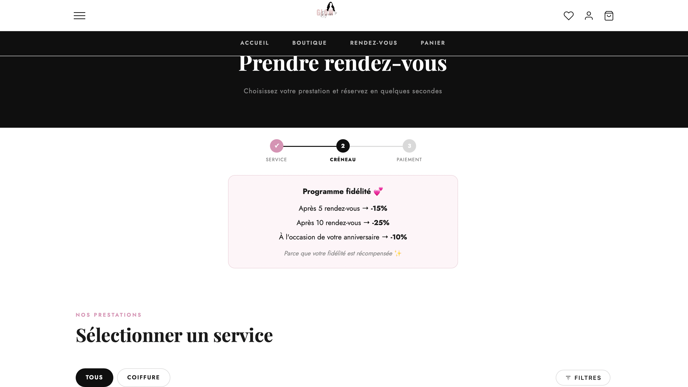
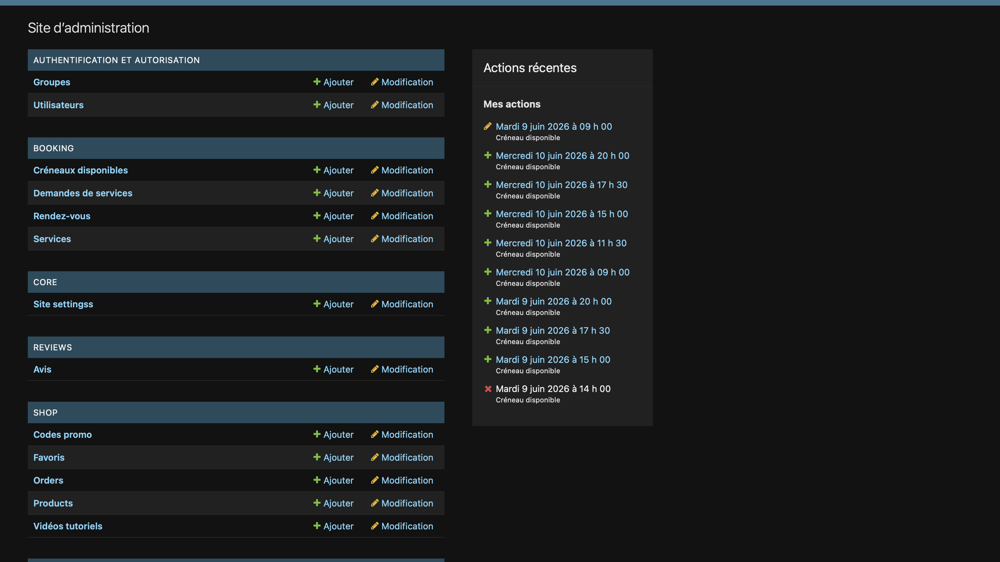

# Glow by Riri

[](https://glowbyriri.store)

Site e-commerce et système de réservation pour une coiffeuse à Trois-Rivières (Québec, Canada), **déployé en production** à l'adresse [glowbyriri.store](https://glowbyriri.store).

Le projet regroupe une boutique en ligne (perruques, laces, produits capillaires) et un système de prise de rendez-vous avec paiement d'acompte.

---

## Aperçu





---

## Fonctionnalités

**Boutique**
- Catalogue produits avec variantes (longueur, type de lace, densité, couleur)
- Panier session, codes promo, option pose (-5%)
- Paiement via Stripe (carte, Klarna, Apple Pay)
- Webhook Stripe pour création de commandes robuste (anti-doublon)
- Génération de facture PDF (ReportLab) envoyée par email
- Suivi de commande par email, liste de souhaits par session

**Réservations**
- Calendrier de créneaux géré par l'admin
- Paiement d'acompte via Stripe
- Rappels automatiques J-1 par email (`send_reminders`)
- Flux alternatif pour services sans créneau (dépôt, customisation)

**Admin**
- Dashboard personnalisé (revenus mensuels, commandes, RDV à venir)
- Rapport stock hebdomadaire (`send_stock_report`)
- Commande `recover_order` pour récupérer une commande manquante depuis Stripe

---

## Stack technique

| Couche | Technologie |
|--------|-------------|
| Backend | Django 4.2, Python 3 |
| Base de données | PostgreSQL (prod), SQLite (tests) |
| Paiements | Stripe (Checkout, Webhooks, Coupons) |
| Emails | Brevo via django-anymail |
| Médias | Cloudinary |
| Static files | Whitenoise |
| Hébergement | Railway + Cloudflare (SSL) |
| PDF | ReportLab |

---

## Lancer le projet en local

```bash
# 1. Cloner et installer les dépendances
git clone https://github.com/idrisstraore192/glow-by-riri
cd glow-by-riri
pip install -r requirements.txt

# 2. Variables d'environnement (voir .env.example)
cp .env.example .env
# Remplir SECRET_KEY, STRIPE_*, BREVO_API_KEY, CLD_*

# 3. Base de données et serveur
python manage.py migrate
python manage.py runserver
```

### Commandes disponibles

```bash
make test       # 157 tests automatisés (SQLite en mémoire)
make run        # Serveur local
make migrate    # Appliquer les migrations
make shell      # Shell Django interactif
```

---

## Tests

157 tests répartis sur 5 fichiers, couvrant :
- Modèles et calculs de prix (remises, variantes, acomptes)
- Logique panier (session, ajout, suppression, codes promo)
- Intégration Stripe (webhook, anti-doublon, Klarna)
- Emails (confirmation commande, RDV, expédition)
- Vues et formulaires

```bash
python manage.py test shop booking --settings=glow_by_riri.settings_test
```

---

## Architecture

```
shop/       # E-commerce : produits, panier, commandes, Stripe
booking/    # Réservations : créneaux, RDV, acompte Stripe
reviews/    # Avis clients avec modération admin
core/       # Page d'accueil, dashboard admin
```

---

## Ce que j'ai appris sur ce projet

- Gestion des webhooks Stripe et prévention des commandes en doublon (webhook + redirect simultanés)
- Déploiement continu sur Railway avec migrations automatiques et SSL via Cloudflare
- Configuration Django multi-environnement (SQLite pour les tests, PostgreSQL en prod)
- Génération de PDF en mémoire avec ReportLab et envoi en pièce jointe email
- Emails transactionnels HTML avec fallback texte brut via Brevo
